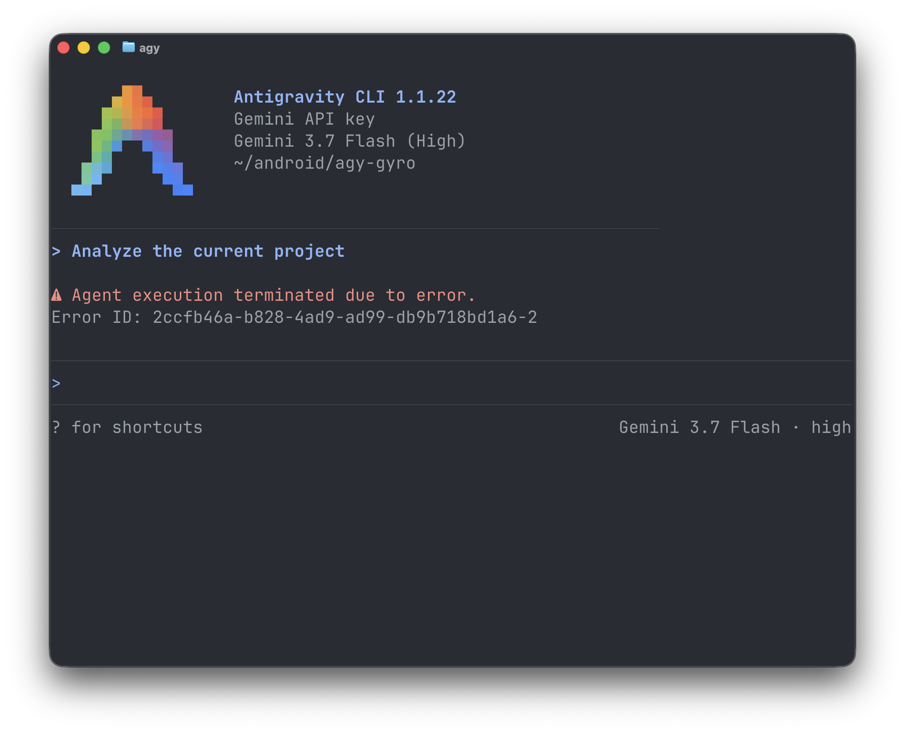

<p align="center">
  
</p>

# agy-gyro

> **Disclaimer**: `agy-gyro` is an independent open-source project and is not affiliated with, endorsed by, or sponsored by Google or the Antigravity team.

`agy-gyro` is a high-performance, lightweight local retry proxy written in Rust designed to stabilize the Antigravity CLI (`agy`) against transient Google Gemini API errors.


## Motivation

### 1. Transient API Errors & Lack of Retries

When interacting with the Google Gemini API directly using an API key, requests occasionally fail due to transient infrastructure errors or capacity limits:

- **HTTP 429 (`RESOURCE_EXHAUSTED`)**: Rate limits (RPM/TPM) or temporary backend capacity spikes.
- **HTTP 503 (`UNAVAILABLE`)**: Model servers temporarily overloaded.
- **HTTP 500 / 502 / 504**: Transient backend gateway or server errors.
- **HTTP 408 / Transport Drops**: Network timeouts or aborted socket connections.

By default, the Antigravity CLI (`agy`) does not implement automatic retry loops with exponential backoff. When an error status code is encountered, `agy` terminates the active session immediately, disrupting the agentic workflow.

<p align="center">
  <br/>
  <em>The dreaded "Agent execution terminated" error</em>
</p>

`agy-gyro` solves this by acting as a transparent local HTTP proxy between `agy` and the upstream Gemini API (`generativelanguage.googleapis.com`). It catches transient errors, retries the requests internally using exponential backoff with jitter (following the [Gemini API Troubleshooting Guide](https://ai.google.dev/gemini-api/docs/troubleshooting)), and only returns the final result to `agy` once resolved (or when retry attempts are exhausted).

```
+------------------+         +---------------------+         +-------------------------------------+
| Antigravity CLI  |  HTTP   |      agy-gyro       |  HTTPS  |          Google Gemini API          |
|      (agy)       | ------> | (127.0.0.1:8080)    | ------> | (generativelanguage.googleapis.com) |
|                  |         |                     |         |                                     |
| Sends prompt or  |         | 1. Buffers req body |         | Evaluates request:                  |
| stream request   |         | 2. Forwards request |         | - 429 / 503 / 500 / 504             |
|                  |         | 3. Retries on error | <------ |   -> Proxy handles backoff + retry  |
| Receives 200 OK  | <------ | 4. Streams response | <------ | - 200 OK                            |
+------------------+         +---------------------+         +-------------------------------------+
```

### 2. Access to Newer / Unlisted Gemini Models

When configured in Gemini API key mode (`"modelProvider": "gemini"`), `agy` uses a static, built-in model registry to validate and present available models. When Google releases newer models or previews on the Gemini API (such as `gemini-3.8-flash`), users cannot select them in `agy` until a new CLI release is published.

Because Gemini REST API schemas (including prompt structures, tool call definitions, and reasoning `thinkingConfig` parameters) are shared across model generations, requests differ primarily by the model identifier in the REST URL. `agy-gyro` enables instant access to new models via transparent model remapping (`--redirect-model`), redirecting outbound requests at the proxy layer without requiring changes to `agy`.

### 3. Clash Auto-Switching & 24-Hour Reliability Priority

When requests fail due to upstream regional capacity, ISP-level routing degradations, or Google's location restrictions (e.g. `User location is not supported`), `agy-gyro` can automatically switch the active proxy node in Clash before retrying.

Rather than naive sequential round-robin, `agy-gyro` features a **scientific 24-hour reliability-based priority scheduler**:
- **24-Hour Hourly Slots (0–23)**: Tracks performance for each 60-minute interval to adapt to diurnal load shifts and regional network congestion.
- **Continuous Exponential Time Decay**: Old statistics decay smoothly with a configurable half-life ($T_{half} = 7$ days by default, $2^{-\Delta t / T_{half}}$) so outdated history doesn't dominate.
- **Burst Damping**: Consecutive requests within a short time window (e.g., 15s) receive diminishing statistical weight ($\Delta S = \frac{1}{1 + 0.5 \times burst}$) to prevent a quick succession of requests from artificially inflating or deflating a node's reputation.
- **Bayesian Shrinkage Scoring**: Uses Empirical Bayes shrinkage towards both the overall node average and a neutral 50% prior ($\alpha=1.0, \beta=1.0$), ensuring that a single failure never destroys a node's standing.
- **Effective Sample Capacity Cap**: Clamps historical sample weight (default 20.0) so nodes can rapidly recover or adapt when conditions change.
- **Multi-Process SQLite Persistence**: Automatically stored in SQLite database (`~/.gemini/antigravity-cli/gyro.db` or `%USERPROFILE%\.gemini\antigravity-cli\gyro.db` on Windows) with WAL mode, ensuring zero data loss, real-time transaction durability, and multi-process concurrency across multiple terminals. Legacy `gyro-stats.json` files are automatically migrated.

## Installation

Install `agy-gyro` using `cargo`:

```bash
cargo install agy-gyro
```

Prebuilt executables for Linux, macOS, and Windows are also available in the [latest GitHub release](https://github.com/topjohnwu/agy-gyro/releases/latest).

## Configuration & Modes

`agy-gyro` operates in three modes: **Wrapper Mode** (default), **Standalone Server Mode**, and **Stats Inspection Mode**.

### Mode 1: Wrapper Mode (Default)

Running `agy-gyro` without subcommands automatically starts an in-process proxy server on a dynamic TCP port (`127.0.0.1:0`), sets `GOOGLE_GEMINI_BASE_URL` automatically, and launches `agy`.

```bash
# Simply launch agy wrapped with agy-gyro proxy:
agy-gyro

# Pass arguments directly through to agy:
agy-gyro -- --dangerously-skip-permissions

# Redirect requests from one model to another (e.g. gemini-3.7-flash -> gemini-3.8-flash):
agy-gyro --redirect-model gemini-3.7-flash:gemini-3.8-flash

# Optionally write proxy logs to a file:
agy-gyro --log-file /tmp/gyro.log
```

### Mode 2: Standalone Server Mode (`agy-gyro server`)

To run `agy-gyro` as a persistent background daemon or standalone server:

```bash
agy-gyro server --port 8080
```

### Mode 3: Inspecting Reliability Statistics (`agy-gyro stats`)

To inspect recorded Clash node rankings, Bayesian reliability scores, and hourly success/failure records:

```bash
# View priority rankings for the current local hour:
agy-gyro stats

# View rankings for a specific hour of day (e.g., 14:00 - 14:59):
agy-gyro stats --hour 14

# View full breakdown across all 24 hours:
agy-gyro stats --all-hours
```

Example output:
```text
==========================================================================
 agy-gyro Node Reliability Priority Statistics
 Stats file: C:\Users\user\.gemini\antigravity-cli\gyro.db
 Settings: half-life=7.0 days, sample-cap=20.0, burst-window=15s
 Last updated: 2026-09-04 21:00:00 UTC
 Total tracked nodes: 3
==========================================================================

--- Hour 21:00 - 21:59 [CURRENT LOCAL HOUR] ---
Rank | Node Name                    | Score    | Hourly (S/F)     | Overall (S/F)   
-----+------------------------------+----------+------------------+-----------------
   1 | US-HighSpeed                 |  88.4%   | 12.0 / 1.0       | 18.5 / 2.0      
   2 | HK-Premium                   |  71.2%   | 4.0 / 1.0        | 10.2 / 3.1      
   3 | JP-Backup                    |  46.7%   | 0.0 / 0.0        | 2.0 / 4.0       
```

### Options & Flags

| Flag                           | Environment Variable                | Default                                     | Description                                                 |
| :----------------------------- | :---------------------------------- | :------------------------------------------ | :---------------------------------------------------------- |
| `-H`, `--host`                 | `AGY_GYRO_HOST`                     | `127.0.0.1`                                 | Host address to bind the proxy server                       |
| `-p`, `--port`                 | `AGY_GYRO_PORT`                     | `0` (wrapper) / `8080` (server)             | Port to listen on (`0` = OS-assigned free port)             |
| `-u`, `--upstream`             | `AGY_GYRO_UPSTREAM_URL`             | `https://generativelanguage.googleapis.com` | Target upstream Gemini API base URL                         |
| `--cloudcode-upstream`         | `AGY_GYRO_CLOUDCODE_URL`            | `https://daily-cloudcode-pa.googleapis.com` | Target upstream Cloud Code API base URL (OAuth mode)        |
| `--agy-path`                   | `AGY_GYRO_AGY_PATH`                 | `agy`                                       | Executable path for Antigravity CLI                         |
| `--log-file`                   | `AGY_GYRO_LOG_FILE`                 | _None_                                      | Path to log file for proxy tracing logs (automatically truncated if sole active instance) |
| `--max-retries`                | `AGY_GYRO_MAX_RETRIES`              | `10000`                                     | Maximum retry attempts for retriable errors                 |
| `--initial-delay-ms`           | `AGY_GYRO_INITIAL_DELAY_MS`         | `200`                                       | Initial retry backoff delay in milliseconds                 |
| `--max-delay-ms`               | `AGY_GYRO_MAX_DELAY_MS`             | `3000`                                      | Maximum backoff delay cap in milliseconds                   |
| `--no-jitter`                  | `AGY_GYRO_NO_JITTER`                | `false`                                     | Disable randomized jitter in backoff calculation            |
| `--no-buffer`                  | `AGY_GYRO_NO_BUFFER`                | `false`                                     | Disable full stream buffering (stream chunks immediately)   |
| `--request-timeout-secs`       | `AGY_GYRO_REQUEST_TIMEOUT_SECS`     | `600`                                       | Timeout per attempt in seconds                              |
| `--redirect-model`             | `AGY_GYRO_REDIRECT_MODEL`           | _None_                                      | Redirect model requests in `FROM:TO` format                 |
| `--clash-api`                  | `AGY_GYRO_CLASH_API`                | `http://127.0.0.1:9097`                     | Clash external-controller base URL                          |
| `--clash-secret`               | `AGY_GYRO_CLASH_SECRET`             | `set-your-secret`                           | Clash external-controller secret token                      |
| `--clash-group`                | `AGY_GYRO_CLASH_GROUP`              | `台美新日`                                  | Clash proxy selector group to rotate nodes within           |
| `--clash-parent`               | `AGY_GYRO_CLASH_PARENT`             | `GLOBAL`                                    | Clash parent selector group (e.g. `GLOBAL`)                 |
| `--no-clash-switch`            | `AGY_GYRO_NO_CLASH_SWITCH`          | `false`                                     | Disable automatic Clash node switching on failure           |
| `--retry-all`                  | `AGY_GYRO_RETRY_ALL`                | `false`                                     | Retry on all non-2xx responses (including 400/401/403)     |
| `--stats-file`                 | `AGY_GYRO_STATS_FILE`               | `~/.gemini/antigravity-cli/gyro.db`         | Path to persistent node reliability stats SQLite DB file    |
| `--no-stats`                   | `AGY_GYRO_NO_STATS`                 | `false`                                     | Disable node statistics collection and priority switching   |
| `--stats-max-samples`          | `AGY_GYRO_STATS_MAX_SAMPLES`        | `20.0`                                      | Maximum effective sample capacity cap per hourly bucket     |
| `--stats-half-life-days`       | `AGY_GYRO_STATS_HALF_LIFE_DAYS`     | `7.0`                                       | Half-life decay in days for historical data                 |
| `--stats-burst-window-secs`    | `AGY_GYRO_STATS_BURST_WINDOW_SECS`  | `15`                                        | Time window in seconds to damp rapid-fire burst requests    |

## Quick Start with Antigravity (`agy`)

### Step 1: Configure `agy` Settings

Ensure Antigravity is configured to use Gemini API key mode:

- **macOS / Linux**: `~/.gemini/antigravity-cli/settings.json`
- **Windows**: `%USERPROFILE%\.gemini\antigravity-cli\settings.json`

```json
{
  "modelProvider": "gemini"
}
```

### Step 2: Launch `agy` using `agy-gyro`

Set your Gemini API key and run `agy-gyro`:

```bash
export GEMINI_API_KEY="your-gemini-api-key"

# Launch agy normally
agy-gyro

# Redirect all requests for gemini-3.7-flash to gemini-3.8-flash:
agy-gyro --redirect-model gemini-3.7-flash:gemini-3.8-flash

# Multiple models can be redirected simultaneously:
agy-gyro \
  --redirect-model gemini-3.7-flash:gemini-3.8-flash \
  --redirect-model gemini-3.5-flash:gemini-3.8-flash
```

`agy-gyro` handles local proxy startup, dynamic port binding, environment variable setup (`GOOGLE_GEMINI_BASE_URL`), and signal forwarding seamlessly!

## Streaming & Error Recovery Behavior

### Default Mode: Full Stream Buffering

In default mode, `agy-gyro` buffers all incoming stream chunks before delivering them to `agy`:
1. **Full Verification**: Ensures every chunk in the response is error-free and that the upstream stream completes cleanly.
2. **Zero-Byte Leakage**: If an error (e.g. `503 UNAVAILABLE`, `429 RESOURCE_EXHAUSTED`, or network disconnect) occurs at chunk 1 or mid-stream, `agy-gyro` discards the buffered chunks and replays the request from scratch.
3. **Flawless Delivery**: `agy` only receives verified, complete streams without partial output or syntax errors.

### Passthrough Mode (`--no-buffer`)

When running with `--no-buffer`, `agy-gyro` verifies Chunk 1 and immediately streams subsequent tokens to minimize time-to-first-token latency:
- **Chunk 1 Error**: Retried seamlessly before sending headers to `agy`.
- **Mid-Stream Error (Chunk $N > 1$)**: Forwarded downstream to prevent duplicated tokens.

## License

This project is licensed under the [MIT License](LICENSE).
